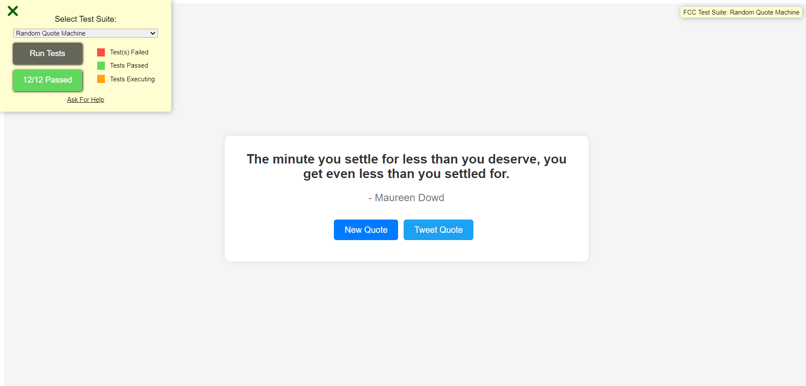

# Random Quote Machine

A simple web application built with React and Vite that displays random quotes fetched from an external API.



## Demo

You can view a live demo of the random quote machine [here](https://random-quote.hackimtech.com/).

## Features

- Displays a random quote on first load.
- Fetches a new random quote on button click.
- Displays the author of the quote.
- Allows users to tweet the current quote.

## Installation

To run this project locally, follow these steps:

1. Clone the repository:
   ```bash
   git clone https://github.com/hackim18/Frontend-Random-Quote-Machine
   cd Frontend-Random-Quote-Machine
   ```
2. Install dependencies:
   ```bash
   npm install
   ```
3. Start the development server:
   ```bash
   npm run dev
   ```
4. Open your browser and navigate to http://localhost:3000.

## Usage

The quote and author are displayed in the center of the page.
Click the "New Quote" button to fetch a new random quote.
Click the "Tweet Quote" button to share the current quote on Twitter.

## Technologies Used

- React
- Vite
- Axios
- HTML/CSS
- JavaScript

## API Used

To fetch random quotes, you can use a public API like Quotes Free API (https://quotes.rest/) or Quotable API (https://quotable.io/).

## Credits

Project inspired by FreeCodeCamp Random Quote Machine.

## License

This project is licensed under the MIT License - see the LICENSE file for details.
